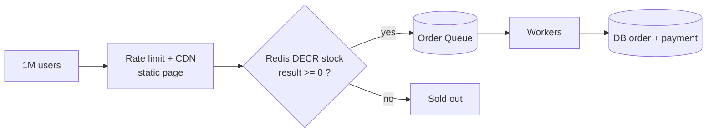

The bug: two requests both read `stock = 1`, both buy → stock becomes `-1`.

```text
Request A: read stock = 1 ─┐
Request B: read stock = 1 ─┤  both see 1
Request A: stock = 0  ✓    │
Request B: stock = 0  ✓  ← SOLD TWICE ✗
```

**Fix — make the decrement atomic:**

```sql
UPDATE products
SET stock = stock - 1
WHERE id = 42 AND stock > 0;   -- 0 rows updated = sold out
```

At very high traffic, do it in Redis first:



- Redis `DECR` is atomic, so only 100 requests get a value `>= 0`.
- The queue protects the DB; workers create orders at a safe pace.
- Release the stock back if payment is not completed within N minutes.

---
