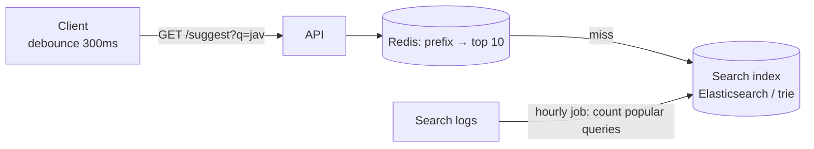

```text
Trie for "ja"
        (root)
          │
          j
          │
          a ──► top: [java, javascript, jamaica]
         / \
        v   m
```

- **Debounce** on the client so typing "javascript" isn't 10 requests.
- Pre-compute the top suggestions per prefix and cache them, rather than ranking on every keystroke.

---
