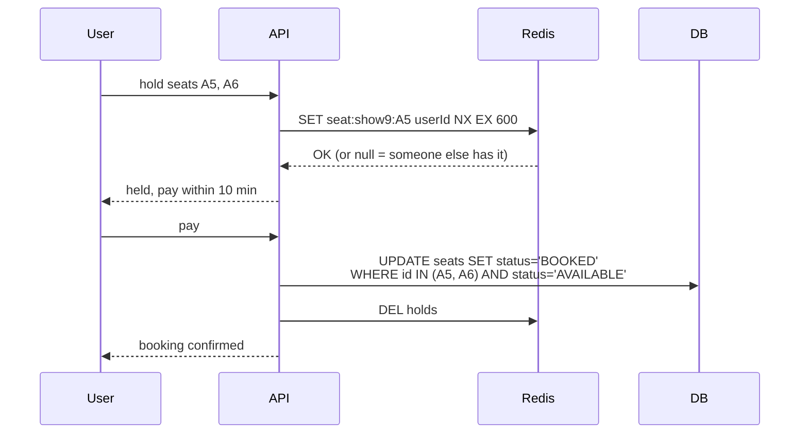

**Requirements:** users pick seats, have 10 minutes to pay, and no seat is ever sold twice.

```text
Seat states

AVAILABLE ──select──► HELD (10 min, userId) ──pay ✓──► BOOKED
    ▲                        │
    └──── timeout / cancel ──┘
```



- The **hold** uses Redis `SET NX EX`: only one user gets it, and it expires on its own if they leave.
- The **final booking** is still protected in the DB (conditional `UPDATE` or a unique constraint on `(show_id, seat_id)`), because Redis is not the source of truth.
- Hold **all seats or none**: if A6 fails, release A5.
- Popular shows: put users in a **virtual waiting room** queue so the booking service isn't flooded.

---
