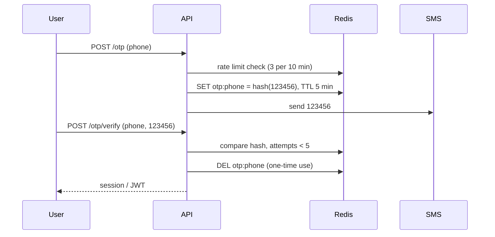

- Store a **hash** of the OTP, never the plain code.
- **TTL** (expire after 5 min) + **one-time use** (delete after success).
- Limit both **sending** (SMS costs money) and **verifying** (stops brute force of 6 digits).

---
