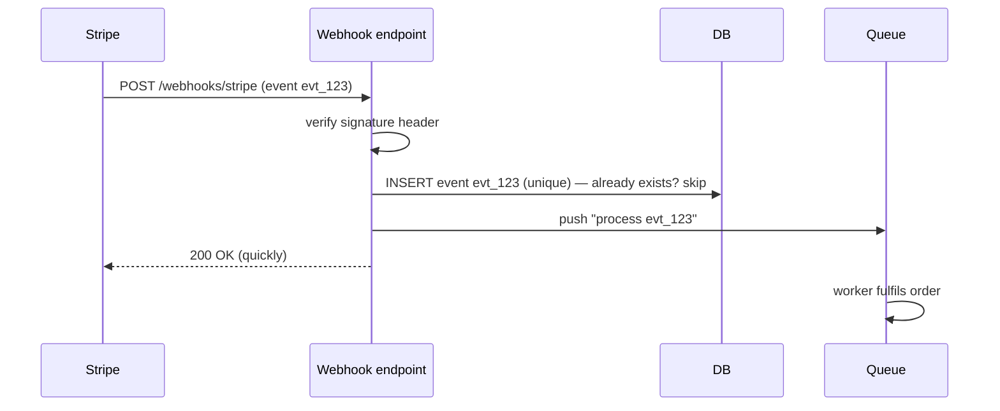

The payment provider calls **your** endpoint when something happens (`payment_intent.succeeded`).

- **Verify the signature** — otherwise anyone can POST "payment succeeded".
- **Respond fast (2xx)**, then do the work in a queue. Slow responses get retried by the provider.
- **Store event IDs with a unique constraint** — providers retry, so the same event arrives more than once.
- Events can arrive **out of order** — check the current state instead of assuming the sequence.
- Never trust the client's "payment done" redirect alone; the webhook (or an API check) is the truth.

---
