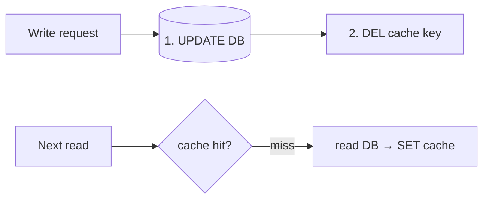

```text
Common bug: update DB, then update cache — two writers race

Writer A: DB = 1 ────────────────────────── cache = 1
Writer B:          DB = 2 ── cache = 2
Final:    DB = 2, cache = 1   ✗ stale forever (until TTL)
```

**Safer default: update the DB, then DELETE the cache key** (the next read refills it).



| Strategy | How | Good for |
| -------- | --- | -------- |
| Cache-aside + delete on write | App deletes the key after DB write | Most apps (default) |
| Write-through | Write cache and DB together | Data read right after writing |
| Write-behind | Write cache, flush to DB later | Counters; risk of data loss |
| CDC (change data capture) | DB change log → event → invalidate cache | Many services caching the same data |

- **Always set a TTL** as a safety net, so any stale value eventually expires.
- Accept that a cache gives **eventual** consistency; don't cache data that must be exact (balances).

---
