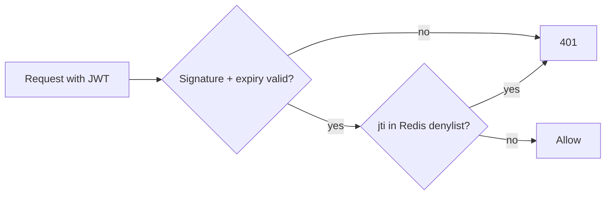

A JWT is valid until it expires — the server doesn't store it, so it can't simply "delete" it.

```text
Access token (15 min) + Refresh token (7 days, stored in DB)

Logout / ban user:
  1. Delete or revoke the refresh token in the DB  → no new access tokens
  2. Old access token still works ≤ 15 min         → acceptable for most apps
  3. Need it to stop NOW? → add its ID (jti) to a Redis denylist until it expires
```



- Keep access tokens **short-lived**, so the window is small.
- "Log out of all devices": store a `tokenVersion` on the user; bump it, and reject tokens with an older version.
- If you need instant revocation everywhere, **server-side sessions** (Redis) may simply be the better choice.

---
