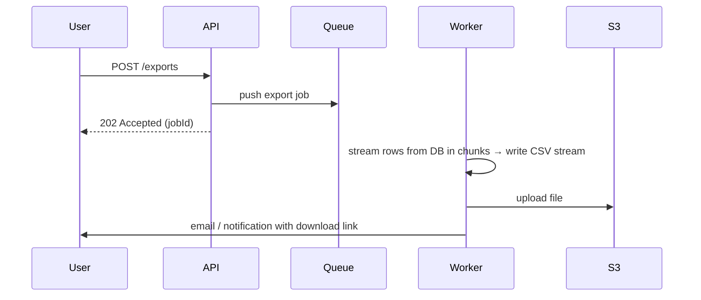

Never build it inside the HTTP request — it will time out and use up the server's memory.

- **Stream** rows with a cursor — never load 5M rows into memory.
- The download link is a pre-signed S3 URL that expires.
- The UI can poll `GET /exports/:jobId` to show progress.

---
