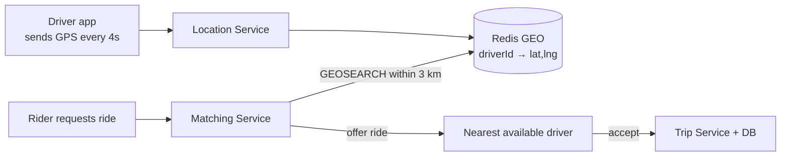

**How do you find "drivers within 3 km" fast?** Don't compare the rider with every driver. Split the map into cells (**geohash**):

```text
Map divided into geohash cells          Rider in cell "tdr1y"
┌──────┬──────┬──────┐                  → search that cell + 8 neighbours
│tdr1v │tdr1y │tdr1z │                    (only a few hundred drivers,
├──────┼──────┼──────┤                     not 1 million)
│tdr1t │ 🧍   │tdr1x │
├──────┼──────┼──────┤
│tdr1s │tdr1u │tdr1w │
└──────┴──────┴──────┘
```

- Driver locations are **write-heavy** and short-lived → keep them in memory (Redis GEO), not the main DB.
- Lock the driver while an offer is pending, so two riders can't get the same driver.
- Live trip tracking: driver location → WebSocket → rider's map.

---
