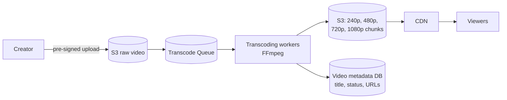

**Adaptive bitrate streaming (HLS / DASH):**

```text
video.mp4 ──transcode──► 1080p: [seg1][seg2][seg3]...   each segment ~4–6 sec
                         720p:  [seg1][seg2][seg3]...
                         480p:  [seg1][seg2][seg3]...
                         + playlist (.m3u8) listing them

Player on fast Wi-Fi  → downloads 1080p segments
Network slows down    → next segment switches to 480p (no buffering)
```

- Upload and transcoding are **async** — status goes `UPLOADING → PROCESSING → READY`.
- Video bytes are served by the **CDN**, never by your API servers.
- View counts use the high-scale counter pattern from Q25.

---
