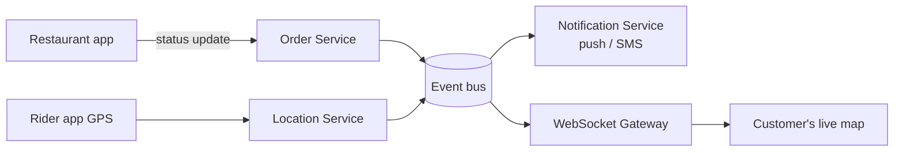

The order is a **state machine** — every change is an event the customer can see.

```text
PLACED ─► ACCEPTED ─► PREPARING ─► PICKED_UP ─► DELIVERED
   │          │
   └──────────┴──► CANCELLED (only allowed before PICKED_UP)
```



- Validate transitions on the server: `DELIVERED → PREPARING` must be rejected.
- Store every status change with a timestamp (an **order history** table) — useful for support and ETAs.
- Live location: push over WebSocket/SSE every few seconds; don't make the client poll.

---
