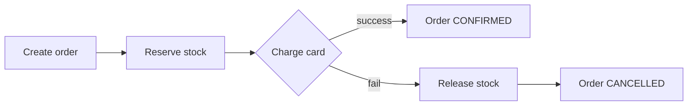

In microservices you can't wrap three services in one DB transaction. A **saga** runs a series of local steps, and if one fails, runs **compensating** steps to undo the earlier ones.

```text
Happy path
  1. Order Service      create order (PENDING)
  2. Inventory Service  reserve stock
  3. Payment Service    charge card
  4. Order Service      mark CONFIRMED

Payment fails at step 3 → compensate backwards
  3 ✗ charge failed
  2 ↩ release reserved stock
  1 ↩ mark order CANCELLED
```



- **Orchestration:** one coordinator service tells each step what to do (easier to follow).
- **Choreography:** each service listens for events (`StockReserved`) and reacts (looser coupling, harder to trace).
- Every step must be **idempotent**, because messages can be delivered twice.

---
