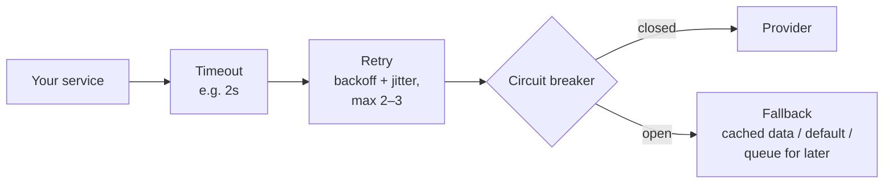

```text
Without protection
  Your API ──► Slow provider (30s timeout)
  every request waits 30s → all threads/connections busy → YOUR app goes down too
```

**Layers of defence:**



**Circuit breaker states:**

```text
CLOSED ──(many failures)──► OPEN ──(after 30s)──► HALF-OPEN
  ▲   calls go through        fail instantly,        let 1 test call through
  │                           don't call provider        │
  └──────────── test succeeds ◄──────────────────────────┘
                test fails ──► back to OPEN
```

- **Timeouts** on every external call — the default is often "wait forever".
- **Fallbacks:** show cached prices, hide the "recommendations" widget, or queue the request and finish it later.
- **Bulkhead:** give each provider its own connection pool, so one slow provider can't use them all.

---
