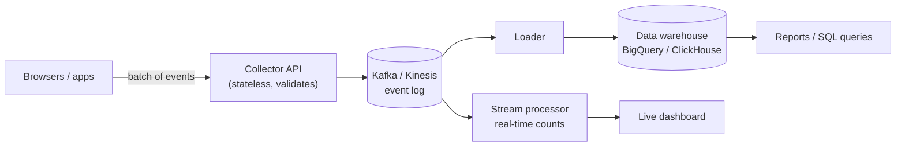

- The client **batches** events (send every 10 sec or every 50 events), not one request per click.
- The collector only validates and appends to the log — no heavy work in the request.
- **Kafka** keeps events for days, so you can replay them if a consumer had a bug.
- Store raw events in a **column-oriented warehouse**, which is fast for "count by day by country".
- Analytics is not your main DB — never run these heavy queries on the production database.

---
