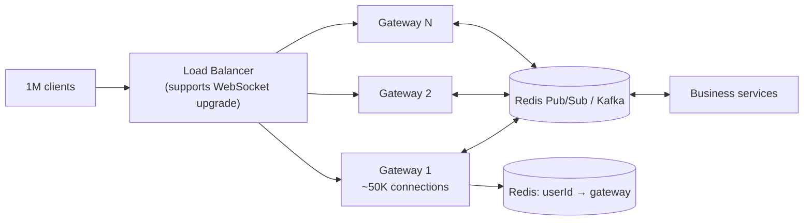

- Each connection is long-lived, so the limit is **memory and file descriptors**, not CPU. Node can hold tens of thousands per instance; plan ~20 gateway servers for 1M.
- Gateways only hold connections; business logic lives in other services.
- To message user X: look up which gateway holds X, publish to that gateway.
- **Reconnect storms:** if a gateway restarts, 50K clients reconnect at once → clients reconnect with random **jitter** and backoff.
- Send heartbeats (ping/pong) to detect dead connections and free resources.

---
