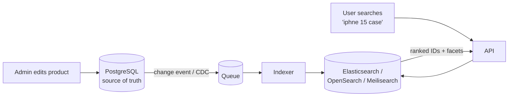

SQL `LIKE '%phone%'` can't use an index and has no relevance ranking or typo tolerance. Use a **search engine** next to your DB.



**Inverted index** — why it's fast:

```text
Docs                         Inverted index
1: "red iphone case"         red     → [1]
2: "iphone charger"          iphone  → [1, 2]
3: "red charger"             case    → [1]
                             charger → [2, 3]
Search "red charger" → intersect → doc 3 first (matches both), then 1, 2
```

- The DB stays the source of truth; the search index is a **copy**, updated asynchronously (may lag by seconds).
- Supports fuzzy matching (typos), synonyms, filters (brand, price range), and facets ("Apple (42)").

---
