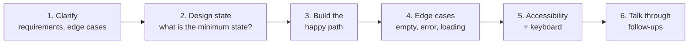

The machine coding round gives you 45–90 minutes to build a small working UI component in React. The tasks below are the ones that repeat across interview reports and the popular machine-coding question lists.

---

**What interviewers grade:**

| Area | What they look for |
| ---- | ------------------ |
| Correctness | It works for the stated requirements |
| Component design | Sensible split into small components / hooks |
| State | **Minimal** state — derive everything else during render |
| Data flow | Clear props and callbacks, effects only for side effects |
| Edge cases | Empty input, loading, errors, double clicks, fast typing |
| Accessibility | Real `<button>`s, labels, keyboard support, ARIA where needed |
| Communication | Explaining choices and trade-offs while coding |

**Golden rule:** a small working solution beats an ambitious broken one. Get the basic version running first, then improve it.

---
