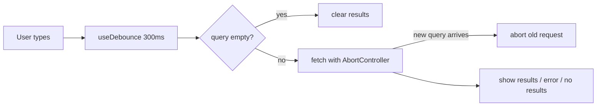

**Requirements:** search an API as the user types, without one request per keystroke; handle loading, errors, and no results; keyboard navigation.



```jsx
function Autocomplete({ onSelect }) {
  const [query, setQuery] = useState('');
  const [results, setResults] = useState([]);
  const [status, setStatus] = useState('idle'); // idle | loading | error | done
  const [isOpen, setIsOpen] = useState(false);
  const [activeIndex, setActiveIndex] = useState(-1);
  const debouncedQuery = useDebounce(query.trim(), 300); // 09-react.md Q114

  useEffect(() => {
    if (!debouncedQuery) {
      setResults([]);
      setStatus('idle');
      return;
    }
    const controller = new AbortController();
    setStatus('loading');
    fetch(`/api/search?q=${encodeURIComponent(debouncedQuery)}`, { signal: controller.signal })
      .then((res) => {
        if (!res.ok) throw new Error(`HTTP ${res.status}`);
        return res.json();
      })
      .then((data) => {
        setResults(data);
        setStatus('done');
        setActiveIndex(-1);
      })
      .catch((err) => {
        if (err.name !== 'AbortError') setStatus('error');
      });
    return () => controller.abort();
  }, [debouncedQuery]);

  function choose(item) {
    setQuery(item.name);
    setIsOpen(false);
    onSelect(item);
  }

  function handleKeyDown(e) {
    if (e.key === 'ArrowDown') {
      e.preventDefault();
      setActiveIndex((i) => Math.min(i + 1, results.length - 1));
    } else if (e.key === 'ArrowUp') {
      e.preventDefault();
      setActiveIndex((i) => Math.max(i - 1, 0));
    } else if (e.key === 'Enter' && activeIndex >= 0) {
      choose(results[activeIndex]);
    } else if (e.key === 'Escape') {
      setIsOpen(false);
    }
  }

  return (
    <div>
      <label htmlFor="search">Search</label>
      <input
        id="search"
        role="combobox"
        aria-expanded={isOpen}
        aria-controls="search-results"
        aria-activedescendant={activeIndex >= 0 ? `option-${results[activeIndex]?.id}` : undefined}
        value={query}
        onChange={(e) => {
          setQuery(e.target.value);
          setIsOpen(true);
        }}
        onKeyDown={handleKeyDown}
      />
      {isOpen && debouncedQuery && (
        <div id="search-results">
          {status === 'loading' && <p>Searching…</p>}
          {status === 'error' && <p role="alert">Something went wrong.</p>}
          {status === 'done' && results.length === 0 && <p>No results for “{debouncedQuery}”.</p>}
          {status === 'done' && results.length > 0 && (
            <ul role="listbox">
              {results.map((item, i) => (
                <li
                  key={item.id}
                  id={`option-${item.id}`}
                  role="option"
                  aria-selected={i === activeIndex}
                  onMouseDown={() => choose(item)}
                >
                  {item.name}
                </li>
              ))}
            </ul>
          )}
        </div>
      )}
    </div>
  );
}
```

- **Debounce** cuts requests from one per key to one per pause.
- **AbortController** stops an old, slow response from overwriting newer results (race condition).
- `onMouseDown` (not `onClick`) fires before the input loses focus.

**Follow-ups:** cache results per query in a `Map` so going back to a previous query is instant; highlight the matching part of each result; a minimum of 2 characters before searching.

---
