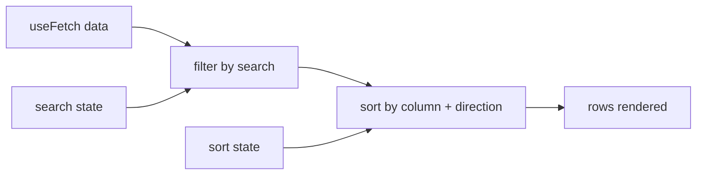

**Requirements:** fetch users, filter by a search box, sort by clicking column headers, handle all four states.



```jsx
function UserTable() {
  const { data, error, loading } = useFetch('/api/users'); // 09-react.md Q115
  const [search, setSearch] = useState('');
  const [sort, setSort] = useState({ key: 'name', dir: 'asc' });

  const rows = useMemo(() => {
    if (!data) return [];
    const q = search.trim().toLowerCase();
    const filtered = q
      ? data.filter((u) => u.name.toLowerCase().includes(q) || u.email.toLowerCase().includes(q))
      : data;
    return [...filtered].sort((a, b) => {
      const cmp = String(a[sort.key]).localeCompare(String(b[sort.key]));
      return sort.dir === 'asc' ? cmp : -cmp;
    });
  }, [data, search, sort]);

  function toggleSort(key) {
    setSort((s) => ({ key, dir: s.key === key && s.dir === 'asc' ? 'desc' : 'asc' }));
  }

  if (loading) return <p>Loading…</p>;
  if (error) return <p role="alert">Couldn't load users.</p>;

  return (
    <div>
      <label htmlFor="user-search">Search</label>
      <input id="user-search" value={search} onChange={(e) => setSearch(e.target.value)} />

      {rows.length === 0 ? (
        <p>No users match “{search}”.</p>
      ) : (
        <table>
          <thead>
            <tr>
              {['name', 'email'].map((key) => (
                <th
                  key={key}
                  aria-sort={sort.key === key ? (sort.dir === 'asc' ? 'ascending' : 'descending') : 'none'}
                >
                  <button onClick={() => toggleSort(key)}>
                    {key} {sort.key === key ? (sort.dir === 'asc' ? '▲' : '▼') : ''}
                  </button>
                </th>
              ))}
            </tr>
          </thead>
          <tbody>
            {rows.map((u) => (
              <tr key={u.id}>
                <td>{u.name}</td>
                <td>{u.email}</td>
              </tr>
            ))}
          </tbody>
        </table>
      )}
    </div>
  );
}
```

- `[...filtered].sort()` copies first — `sort` mutates, and `data` must not be mutated.
- `useMemo` is reasonable here because filtering + sorting a big list on every keystroke is real work.
- The four states: loading, error, empty ("no users match"), and success.

**Follow-ups:** debounce the search for very large lists; paginate the rows; sort numbers and dates correctly instead of as strings.

---
